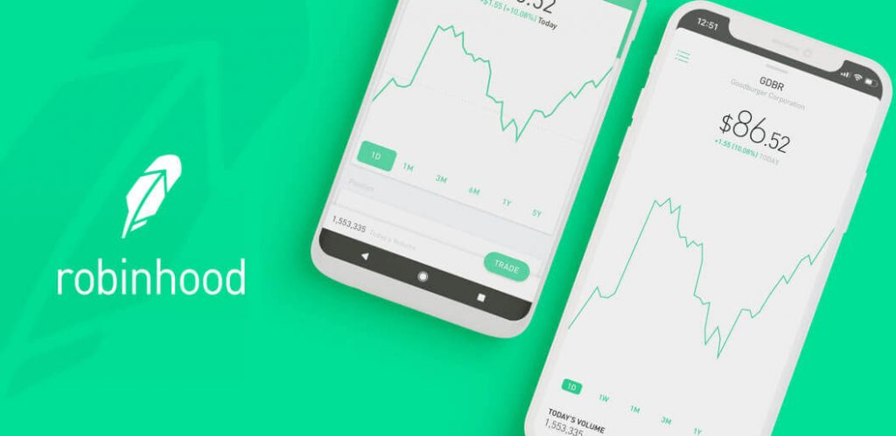

# ROBINHOOD CASE STUDY

## Robinhood: Overview and Origin

Robinhood Markets, Inc. is a U.S.-based financial services company headquartered in Menlo Park, California. The company offers a mobile app and website that offers people the ability to invest in stocks, ETFs, and options through Robinhood Financial and crypto trading through Robinhood Crypto.

Robinhood was founded on April 18, 2013 by Vladimir Tenev and Baiju Bhatt. Both had previously built high-frequency trading platforms for large financial institutions in NYC before moving on to create Robinhood.

The creation of Robinhood was driven by a goal to "provide everyone with access to the financial markets, not just the wealthy."

In April of 2017, Robinhood raised $110 Million at a $1.3 Billion valuation led by Yuri Milner of DST Global, Greenoaks Capital, and Thrive Capital. On May 10, 2018, Robinhood closed a $363 Million Series D financing round led by DST Global. As of May 2018, Robinhood had raised a total of $539 Million in venture capital fudning, with the last valuation at $5.6 Billion.  

## Robinhood: Business Activities

The primary problem point that Robinhood identified in the investment industry was the inability of the masses to participate in the equity markets. In a time when socio-economic inequality was quickly becoming a hot topic, Robinhood sought to level the playing field by giving everyone access, not just a privileged few. 

Robinhood's intended customers were the tech-savvy generation of millenials, who despite having lived their entire lives immersed in technology, were nevertheless priced almost entirely out of the stock market due to the economic troubles of 2008. 

As of 2020, Robinhood is estimated to have at least 10 million individual customers with total assets under management estimated to be around $20 Billion.

Whie many of its competitors have followed suit, Robinhood was the first to offer a truly mobile platform, targeting the widespread use of smartphones among nearly every demographic. This strategy gives them a significant competitive edge as Robinhood has very little of the traditional overhead that other investment firms have in the way of real estate, utilites, and customer facing employees. This advantage may have also been responsible for allowing Robinhood to be the first trading platform to offer zero commission on trades. 

Similar to many other startups in recent history, Robinhood's trading platform was built on AWS (Amazon Web Services). This foundation gave the platform flexibility and scalability combined with less up front fixed costs. It also meant that Robinhood did not have to hold those depreciating assets on their balance sheets, making it more nimble and agile compared to the incumbents within the industry.

Robinhood also uses a wide array of additional tech such as Python, GitHub, Git, and Slack, among others. 

## Robinhood: Landscape

Robinhood exists within the domain of investment/trading platforms and has largely precipitated many of the trends within this sector of the financial industry in the last 10 years, specifically the commission free trading platforms.

Among its largest competitors in this space are companies like Firstrade, Merrill Edge, Aly Invest, Fidelity, Charles Schwab and E*TRADE.

## Robinhood: Results

Robinhood's branding and mission statement did a fantastic job of taking advantage of the post-2008 social climate. Its expressed desire to "provide everyone with access to the financial markets, not just the wealthy," played well to many people who felt disenfranchised and excluded from the financial economy, especially the millenial generation. However, this narrative only portrays one half of the story.

A characteristic of the US economy not frequently talked about in public is the growing demographic problem that we as a country face. As the baby boomer generation nears retirement, the country will inevitably be confronted with a demographic cliff. Baby boomers have already been forced to postpone retirement to ages that were simply unheard of in previous generations, thus only exacerbating the problem. 

As baby boomers begin to retire en masse, their regular contributions into the equity markets (401k's for example) will cease. Not only will that deprive the market of cash, but these retirees will begin withdrawing money from their investment portfolios. Combine that with the fact that the last several decades have been marked by ever increasing levels of corporate greed, where entire industries have been offshored in the name of short term profits and shareholder returns, and you end up in a situation like the one we have today where millenials and simply do not have decent paying jobs, let alone any money to invest in the equity marekts to replace and surpass the money being taken out by the baby boomers.

The combination of these 2 phenomena are doubly bearish for the stock market and it has been a looming crisis that few have talked about. It would seem then, that Robinhood's creation was not intended to solve a lack of access to the financial markets, but rather to solve a lack of cashflow into the markets. Essentially, Robinhood does not benefit the poor as its name would suggest, but actually helps the rich and powerful stay that way. As the saying goes, "the house always wins," and in this case, the "house" refers to the already rich and experienced investors and traders. 

Its not "supply and demand" but "demand and supply". The millenials were not clamoring for access to equity markets, and even if they were, they simply do not have the money to invest nor the expertise to invest safely. Rather, Robinhood solves a signficant looming cashflow crisis by luring millenials (and what little money they have) into the markets using false promises of wealth and easy money. The later addition of cryptocurrency trading to the Robinhood platform is a further example of this. 

The primary impact of Robinhood on the economy is actually the opposite of what their mission statement claims to be. Instead of empowering millenials by giving them access to the markets, Robinhood is luring uneducated and unprepared millenials into the equity markets, enticing them to gamble with money they don't have and can't afford to lose, with the ultimate goal of using their money to help prop up the stock market at a time when it needs it the most. 

While Robinhood is a clever name that evokes a sense of fairness and equality, it couldn't be further from the truth and in fact, the company is doing quite literally the opposite of its stated mission. In truth, Robinhood takes money from the poor, uneducated masses and gives it to the rich, sophisticated few.

Because Robinhood targets the younger generations, its core metrics and KPI's could be a combination of Assets Under Management and customer demographics, namely age and socioeconomic status. By these metrics, Robinhood has been successful. While older and more established traders and investors shun Robinhood, it is popular among the urban and technologically savvy youth. 

## Recomendations

Moving forward, Robinhood should maintain and increase its brand awareness, particularly among the young Generation Z and beyond. The baby boomers were enticed into 401k's and pension plans, but the stable, corporate job market does not exist for upcoming generations and these future generations will not be in a position to set up 401k's and pension funds. Instead, Robinhood can continue to provide an alternative to these traditional investment vehicles and must continue to stress its mission statement of providing financial success to the disenfranchised masses. 

Another avenue into Generation Z and future generations is through gaming. Whether it be through a payment processing platform for in-game transactions or something else, a great way to secure brand awareness and loyalty of future generations is through the gaming industry.

Getting back to its more traiditional business model, Robinhood needs to increase its promotional offers to entice new customers to join the platform. Whether it be free money for referring new customers or a sign-up bonus, Robinhood needs to push aggresively to become and remain the dominant platform for the under-30 crowd. 

While Robinhood does allow trading of Bitcoin and a few other crytocurrencies, it needs to go further. Robinhood must allow trading of all altcoins and must add the ability to transfer cryptocurrencies between other Robinhood users as well as other cryptocurrency wallets. Robinhood also needs to secure partnerships with other companies and platforms that accept crytocurrencies as a form of payment. These developments will further ensure Robinhood's market share growth and dominance.
